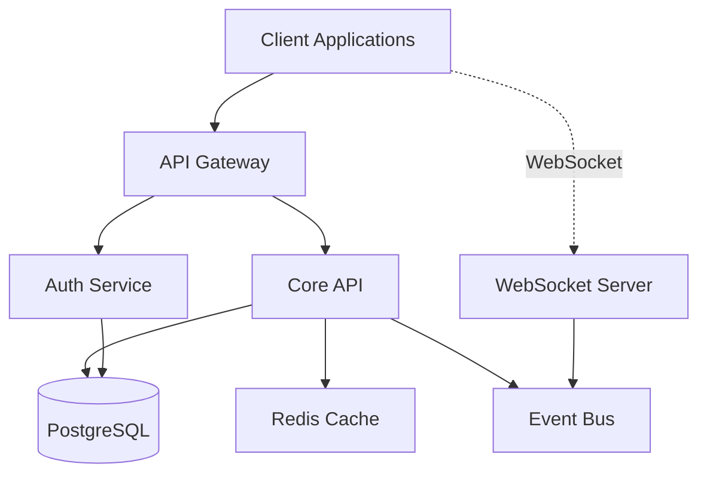
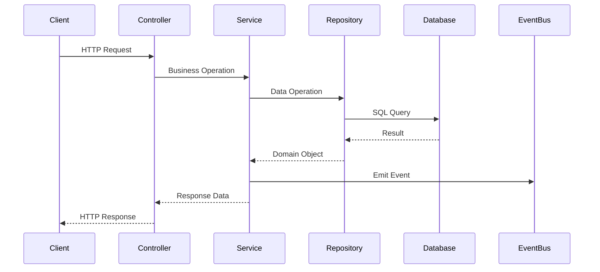
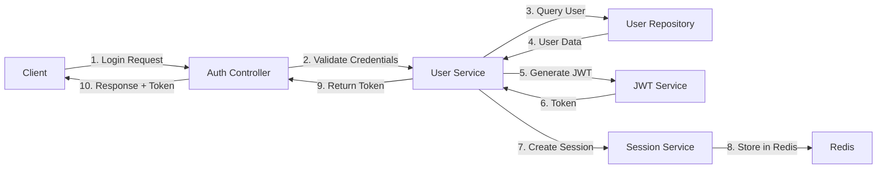
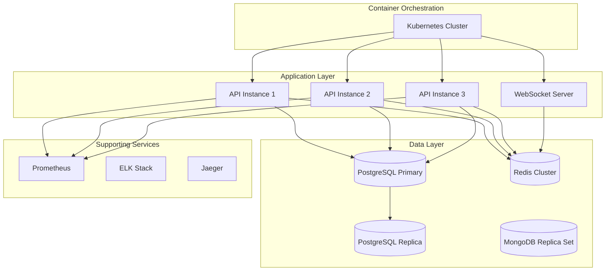
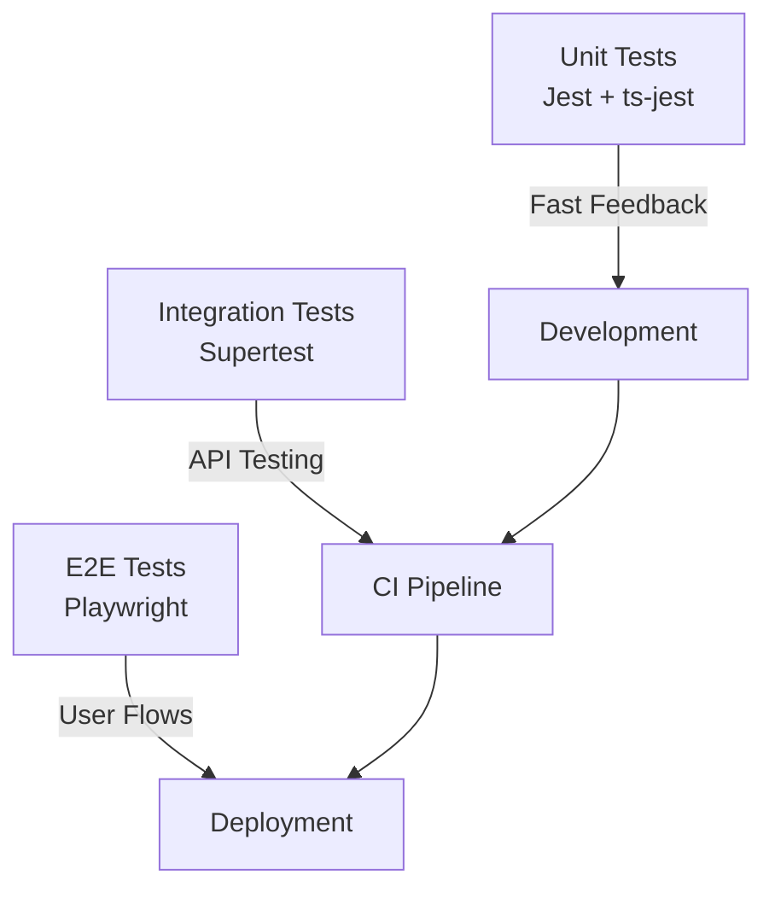
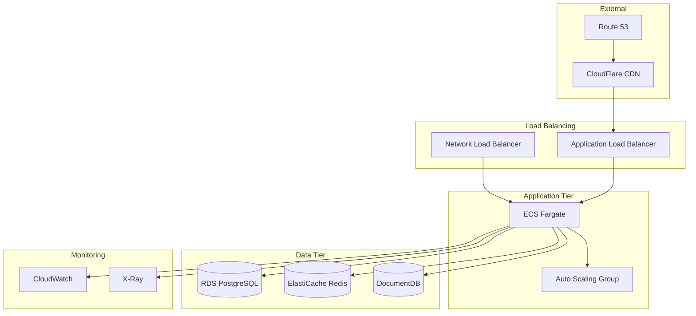

# Architecture Documentation

## Table of Contents
1. [System Overview](#system-overview)
2. [Architecture Principles](#architecture-principles)
3. [Component Architecture](#component-architecture)
4. [Data Architecture](#data-architecture)
5. [Security Architecture](#security-architecture)
6. [Infrastructure](#infrastructure)
7. [Development Workflow](#development-workflow)
8. [Deployment Architecture](#deployment-architecture)

## System Overview

This Express.js microservice template implements a modern, scalable architecture designed for enterprise applications. The system follows domain-driven design principles with a component-based architecture that promotes modularity, testability, and maintainability.

### Recent Refactoring (2025)
The architecture has been significantly improved through a comprehensive refactoring process:

- **Database Simplification**: Removed MongoDB support, now using PostgreSQL with Prisma ORM as the single source of truth
- **Enhanced Component System**: Improved component auto-discovery with better dependency management and lifecycle handling
- **Separation of Concerns**: Separated Express app configuration from server lifecycle management
- **Configuration Validation**: Enhanced environment variable validation with Zod schemas and runtime validation
- **Improved Testing**: Comprehensive test coverage with 134 tests covering all core functionality
- **Modern TypeScript**: Updated to use latest TypeScript features and strict type checking

### High-Level Architecture



### Technology Stack

| Layer | Technology | Purpose |
|-------|------------|---------|
| Runtime | Node.js 18+ | JavaScript runtime with ES2022 support |
| Framework | Express.js 5.1 | Web application framework |
| Language | TypeScript 5.8+ | Type-safe JavaScript |
| ORM | Prisma | Type-safe database access |
| Validation | Zod | Runtime type validation |
| Authentication | JWT + Passport | Token-based auth with OAuth |
| Logging | Pino | High-performance structured logging |
| Testing | Jest + Playwright | Unit, integration, and E2E testing |
| Documentation | Swagger/OpenAPI | API documentation |
| Containerization | Docker | Application containerization |

## Architecture Principles

### 1. Component-Based Design
- Self-contained feature modules
- Clear separation of concerns
- Auto-discovery mechanism
- Standardized file structure

### 2. Layered Architecture
```
┌─────────────────────────────────────┐
│         Presentation Layer          │ ← Controllers, Routes
├─────────────────────────────────────┤
│         Business Logic Layer        │ ← Services, Domain Logic
├─────────────────────────────────────┤
│         Data Access Layer           │ ← Repositories, Prisma
├─────────────────────────────────────┤
│         Infrastructure Layer        │ ← Database, Cache, External Services
└─────────────────────────────────────┘
```

### 3. SOLID Principles
- **Single Responsibility**: Each class/module has one reason to change
- **Open/Closed**: Open for extension, closed for modification
- **Liskov Substitution**: Derived classes substitutable for base classes
- **Interface Segregation**: Many specific interfaces over general ones
- **Dependency Inversion**: Depend on abstractions, not concretions

### 4. Domain-Driven Design
- Bounded contexts for different domains
- Rich domain models with business logic
- Repository pattern for data access
- Value objects for domain concepts

## Component Architecture

### Component Structure

Each component follows a standardized structure:

```
src/components/<component-name>/
├── index.ts                 # Component exports and metadata
├── <name>s.controller.ts    # HTTP request handlers
├── <name>s.service.ts       # Business logic
├── <name>s.routes.ts        # Route definitions
├── <name>s.validation.ts    # Zod schemas
├── <name>s.types.ts         # TypeScript types
├── <name>s.repository.ts    # Data access (if needed)
└── <name>s.service.spec.ts  # Unit tests
```

### Component Registry

Components are auto-discovered at startup:

```typescript
// Component metadata in index.ts
export const metadata: ComponentMetadata = {
  name: 'users',
  version: '1.0.0',
  dependencies: ['auth', 'database'],
  routes: userRoutes,
  migrations: ['001_create_users.sql'],
  events: ['user.created', 'user.updated']
};
```

### Inter-Component Communication



## Data Architecture

### Database Strategy

#### Primary Database (PostgreSQL)
- Relational data with ACID compliance
- Complex queries and transactions
- Managed through Prisma ORM
- Migration-based schema evolution

#### Cache Layer (Redis)
- Session storage
- Response caching
- Rate limiting counters
- Pub/Sub for real-time features

#### Document Store (MongoDB)
- **Removed**: MongoDB support has been removed as part of the 2025 refactoring
- **Rationale**: Simplified architecture using PostgreSQL with Prisma ORM as single source of truth
- **Migration**: Existing MongoDB data should be migrated to PostgreSQL using Prisma migrations

### Repository Pattern

```typescript
// Base repository with generic CRUD
abstract class BaseRepository<T, CreateDTO, UpdateDTO> {
  protected abstract model: PrismaModelDelegate;
  
  async findById(id: string): Promise<T | null>
  async findMany(filter: FilterQuery): Promise<T[]>
  async create(data: CreateDTO): Promise<T>
  async update(id: string, data: UpdateDTO): Promise<T>
  async delete(id: string): Promise<void>
}

// Specific repository with domain logic
class UserRepository extends BaseRepository<User, CreateUserDTO, UpdateUserDTO> {
  async findByEmail(email: string): Promise<User | null>
  async verifyPassword(user: User, password: string): Promise<boolean>
  async incrementLoginAttempts(userId: string): Promise<void>
}
```

### Database Migrations

```bash
# Create migration
npx prisma migrate dev --name add_user_roles

# Apply migrations
npx prisma migrate deploy

# Reset database
npx prisma migrate reset
```

### Data Models

```prisma
model User {
  id                String    @id @default(cuid())
  email             String    @unique
  password          String?
  firstName         String
  lastName          String
  emailVerified     Boolean   @default(false)
  active            Boolean   @default(true)
  
  // Relations
  roles             UserRole[]
  sessions          Session[]
  
  // Timestamps
  createdAt         DateTime  @default(now())
  updatedAt         DateTime  @updatedAt
  
  // Indexes
  @@index([email])
  @@index([createdAt])
}
```

## Security Architecture

### Authentication Flow



### Security Layers

1. **Network Security**
   - HTTPS enforcement
   - CORS configuration
   - Rate limiting per endpoint
   - IP allowlisting (optional)

2. **Application Security**
   - Input validation (Zod)
   - SQL injection prevention (Prisma)
   - XSS protection (Helmet)
   - CSRF protection

3. **Authentication & Authorization**
   - JWT with refresh tokens
   - OAuth 2.0 providers
   - Two-factor authentication
   - Role-based access control

4. **Data Security**
   - Password hashing (bcrypt)
   - Encryption at rest
   - Secure session management
   - Audit logging

### Security Constants

```typescript
export const SECURITY = {
  PASSWORD: {
    SALT_ROUNDS: 10,
    MIN_LENGTH: 8,
    MAX_LENGTH: 128,
    REQUIRE_UPPERCASE: true,
    REQUIRE_LOWERCASE: true,
    REQUIRE_NUMBER: true,
    REQUIRE_SPECIAL: true
  },
  SESSION: {
    DURATION_MS: 24 * 60 * 60 * 1000, // 24 hours
    REFRESH_THRESHOLD_MS: 60 * 60 * 1000, // 1 hour
    MAX_SESSIONS_PER_USER: 5
  },
  LOGIN: {
    MAX_ATTEMPTS: 5,
    LOCK_DURATION_MS: 2 * 60 * 60 * 1000, // 2 hours
    ATTEMPT_WINDOW_MS: 15 * 60 * 1000 // 15 minutes
  }
};
```

## Infrastructure

### Service Architecture



### Docker Configuration

#### Multi-Stage Build
```dockerfile
# Stage 1: Dependencies
FROM node:18-alpine AS deps
WORKDIR /app
COPY package*.json ./
RUN npm ci --only=production

# Stage 2: Build
FROM node:18-alpine AS builder
WORKDIR /app
COPY package*.json ./
RUN npm ci
COPY . .
RUN npm run build

# Stage 3: Production
FROM node:18-alpine AS production
WORKDIR /app
COPY --from=deps /app/node_modules ./node_modules
COPY --from=builder /app/dist ./dist
COPY --from=builder /app/prisma ./prisma
EXPOSE 4010
CMD ["node", "dist/server.js"]
```

### Environment Configuration

```yaml
# docker-compose.yml
services:
  app:
    build: .
    environment:
      NODE_ENV: production
      DATABASE_URL: ${DATABASE_URL}
    depends_on:
      - postgres
      - redis
    healthcheck:
      test: ["CMD", "curl", "-f", "http://localhost:4010/health"]
      interval: 30s
      timeout: 10s
      retries: 3
```

## Development Workflow

### Code Generation

```bash
# Generate new component
npm run generate:component user-profile

# Creates:
# - src/components/user-profile/
#   ├── index.ts
#   ├── user-profile.controller.ts
#   ├── user-profile.service.ts
#   ├── user-profile.routes.ts
#   ├── user-profile.validation.ts
#   ├── user-profile.types.ts
#   └── user-profile.spec.ts

# Generate test for existing file
npm run generate:test src/services/email.service.ts
```

### Testing Strategy



### Git Workflow

```bash
# Feature branch workflow
git checkout -b feature/JIRA-123-user-profile
npm run test
npm run lint:fix
git add .
git commit -m "feat: add user profile component"
git push origin feature/JIRA-123-user-profile

# Pre-commit hooks
# - Run linting
# - Run type checking
# - Run unit tests
# - Format code
```

## Deployment Architecture

### Production Deployment



### Scaling Strategy

#### Horizontal Scaling
- Auto-scaling based on CPU/memory
- Read replicas for databases
- Redis cluster for caching
- Load balancing across instances

#### Vertical Scaling
- Instance type optimization
- Database performance tuning
- Connection pooling
- Query optimization

### Monitoring & Observability

#### Metrics
- Request rate and latency
- Error rates and types
- Database query performance
- Cache hit/miss rates
- WebSocket connections

#### Logging
- Structured JSON logs
- Correlation IDs for tracing
- Log aggregation with ELK
- Log retention policies

#### Alerting
- Critical error thresholds
- Performance degradation
- Security incidents
- Resource utilization

### Disaster Recovery

#### Backup Strategy
- Daily automated backups
- Point-in-time recovery
- Cross-region replication
- Backup retention: 30 days

#### Recovery Procedures
1. Database restoration from snapshot
2. Redis cache warming
3. Service health verification
4. Traffic gradual migration

### Performance Optimization

#### API Performance
- Response caching
- Query optimization
- Pagination and filtering
- Compression (gzip/brotli)

#### Database Performance
- Indexing strategy
- Query optimization
- Connection pooling
- Read/write splitting

#### Caching Strategy
- Redis for session data
- CDN for static assets
- Application-level caching
- Database query caching

## Best Practices

### Code Quality
- TypeScript strict mode
- ESLint + Prettier
- Pre-commit hooks
- Code review process
- Documentation requirements

### Security
- Regular dependency updates
- Security scanning (npm audit)
- OWASP compliance
- Penetration testing
- Security training

### Performance
- Performance budgets
- Load testing
- Profiling and optimization
- Monitoring and alerting
- Capacity planning

### Maintainability
- Component-based architecture
- Clear separation of concerns
- Comprehensive testing
- Documentation
- Code generation tools

## Conclusion

This architecture provides a robust, scalable foundation for building enterprise-grade microservices. The component-based design, combined with modern development practices and comprehensive tooling, ensures maintainability and developer productivity while meeting performance and security requirements.

For implementation details and specific code examples, refer to the source code and component documentation.